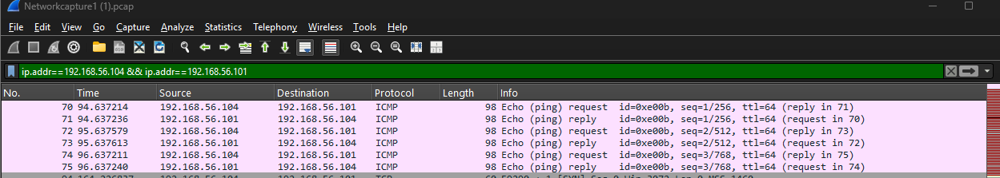
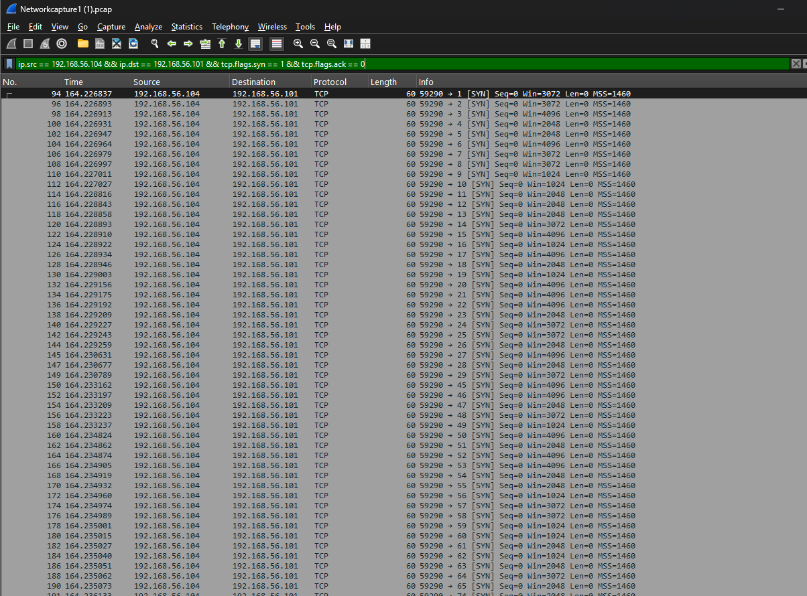
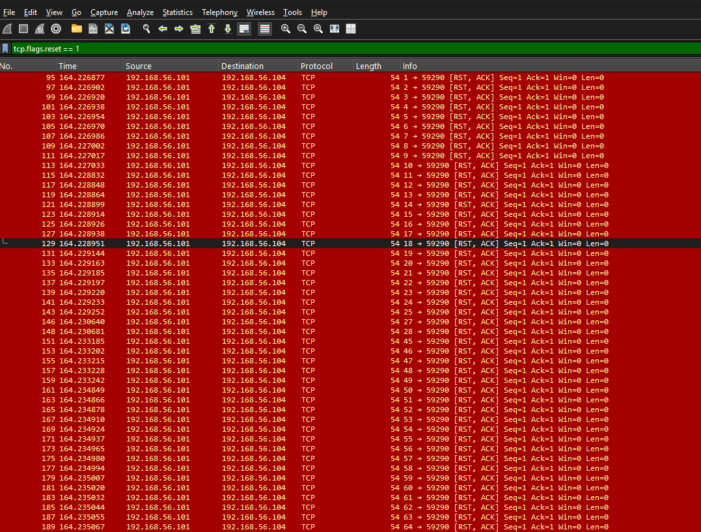

# PCAP 1 — Reconnaissance and TCP Port Scan Analysis

## Overview

This investigation involved analysing network traffic in Wireshark to identify potentially suspicious or malicious behaviour within a packet capture.

Analysis identified ICMP host discovery activity followed by TCP SYN packets targeting numerous destination ports, consistent with network reconnaissance and TCP port scanning.

## Tools

- Wireshark
- PCAP network capture
- Wireshark display filters
- TCP/IP and ICMP protocol analysis

## Key Hosts

| Role | IP Address |
|---|---|
| Scanning host | `192.168.56.104` |
| Target host | `192.168.56.101` |

---

## Finding 1 — ICMP Reconnaissance

ICMP Echo requests were observed from `192.168.56.104` to `192.168.56.101`, with the target responding with ICMP Echo replies.

This traffic is consistent with host discovery activity occurring before the subsequent port scan.

### Wireshark Filter

```text
ip.addr == 192.168.56.104 && ip.addr == 192.168.56.101
```

### Evidence



The capture shows ICMP Echo requests and replies between the identified hosts, providing evidence of host discovery activity before the TCP scanning behaviour.

---

## Finding 2 — TCP SYN Port Scan

Further analysis identified a large number of TCP SYN packets originating from `192.168.56.104` and targeting `192.168.56.101`.

The SYN packets were sent to numerous destination ports without completing normal TCP three-way handshakes. This pattern is consistent with TCP SYN scanning, which can be used during reconnaissance to identify accessible ports and services on a target system.

### Wireshark Filter

```text
ip.src == 192.168.56.104 && ip.dst == 192.168.56.101 && tcp.flags.syn == 1 && tcp.flags.ack == 0
```

### Evidence



The capture shows repeated TCP SYN packets targeting numerous destination ports. The pattern is consistent with TCP SYN scanning used to identify accessible services on the target host.

---

## Finding 3 — TCP Reset Responses

Analysis also identified a large number of TCP reset responses associated with the scanning activity.

The target host generated RST/ACK responses across numerous ports, indicating that connection attempts were being rejected or that the targeted ports were closed.

When viewed alongside the large number of SYN packets sent to different ports, these responses provide further evidence of systematic port scanning activity.

### Wireshark Filter

```text
tcp.flags.reset == 1
```

### Evidence



Filtering for TCP reset flags shows numerous RST/ACK responses from the target host across the scanned ports, supporting the identification of systematic port-scanning activity.

---

## Analysis

The sequence of network activity indicates a reconnaissance process.

First, ICMP traffic was used to determine whether the target host was active. This was followed by a large number of TCP SYN packets targeting different destination ports.

The responses from the target, including numerous TCP reset packets, helped reveal the state of the targeted ports.

Together, these behaviours are consistent with network reconnaissance and TCP port scanning.

## Security Impact

Port scanning does not necessarily represent a successful compromise, but it is commonly used during the reconnaissance stage of an attack.

An attacker may use scanning to identify:

- Active hosts
- Open and closed ports
- Exposed network services
- Potential attack surfaces
- Systems that may require further investigation

Detecting unusual scanning behaviour can therefore provide an early warning of potentially malicious activity.

## Mitigation and Detection

Organisations can reduce the risk associated with reconnaissance and port scanning by:

- Using firewalls to restrict unnecessary inbound connections
- Closing unused ports and services
- Monitoring unusual volumes of connection attempts
- Deploying intrusion detection or prevention systems
- Using network monitoring and logging to identify scanning patterns
- Applying rate limiting where appropriate

## Skills Demonstrated

Through this investigation, I demonstrated practical experience in:

- Network traffic analysis using Wireshark
- PCAP analysis
- Wireshark display filtering
- TCP/IP protocol analysis
- ICMP analysis
- Identifying network reconnaissance
- Detecting TCP SYN port scanning
- Analysing TCP flags and connection behaviour
- Identifying suspicious network activity
- Documenting security investigation findings

## Key Learning

This investigation improved my understanding of how reconnaissance activity can be identified through packet-level network analysis.

By analysing ICMP traffic, TCP SYN packets and TCP reset responses, I was able to identify a sequence of activity consistent with host discovery followed by TCP port scanning.

The exercise also strengthened my ability to use Wireshark display filters to isolate relevant traffic and interpret TCP/IP behaviour when investigating potentially suspicious network activity.
