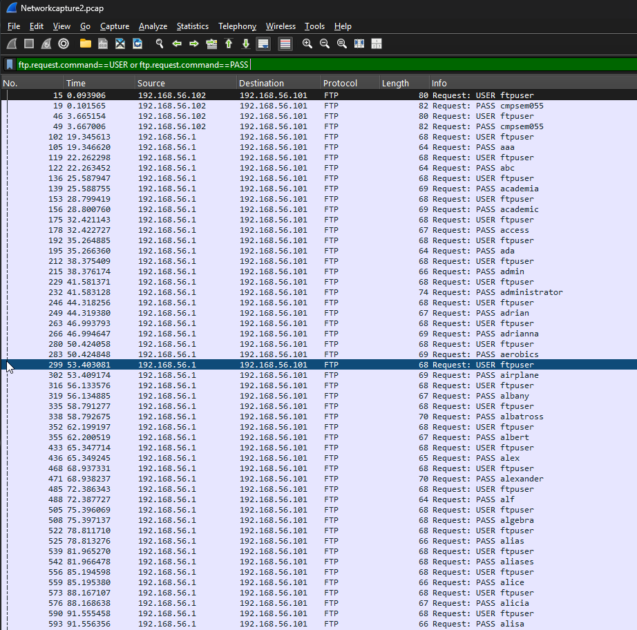
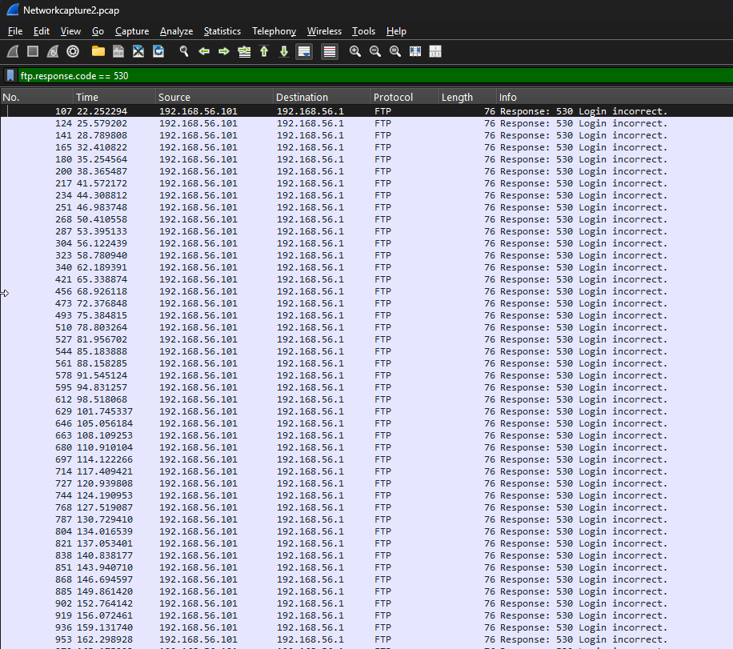

# PCAP 2 — FTP Brute Force Attack Analysis

## Overview

This investigation involved analysing network traffic in Wireshark to identify suspicious FTP authentication activity within a packet capture.

Analysis revealed a large number of repeated FTP username and password attempts followed by `530 Login incorrect` responses. The traffic pattern is consistent with an automated FTP brute-force or password-guessing attack.

## Tools

- Wireshark
- PCAP network capture
- Wireshark display filters
- FTP protocol analysis
- TCP/IP traffic analysis

## Key Hosts

| Role | IP Address |
|---|---|
| Suspected attacking host | `192.168.56.1` |
| FTP server | `192.168.56.101` |

---

## Finding 1 — Repeated FTP Authentication Attempts

Analysis of the FTP traffic identified repeated `USER` and `PASS` commands sent to the FTP server.

Numerous password values were attempted against the `ftpuser` account. The rapid sequence and number of authentication attempts are consistent with automated password guessing rather than normal user login behaviour.

### Wireshark Filter

```text
ftp.request.command == USER or ftp.request.command == PASS
```

### Evidence



The capture shows a continuous sequence of FTP `USER` and `PASS` commands containing different password attempts. This behaviour provides evidence of systematic password guessing against the FTP service.

---

## Finding 2 — Failed FTP Authentication Responses

Further analysis identified numerous FTP `530 Login incorrect` responses from the server.

A high number of authentication failures occurring alongside repeated username and password attempts provides further evidence of brute-force activity.

### Wireshark Filter

```text
ftp.response.code == 530
```

### Evidence



The capture shows repeated `530 Login incorrect` responses generated by the FTP server following unsuccessful authentication attempts.

---

## Analysis

The packet capture demonstrates a pattern of repeated FTP authentication attempts against the target server.

The attacking traffic repeatedly submits the username `ftpuser` followed by different password values. The FTP server responds to these attempts with repeated `530 Login incorrect` messages.

The combination of repeated credential attempts and large numbers of failed authentication responses is consistent with an FTP brute-force or automated password-guessing attack.

## Security Impact

A successful brute-force attack against an FTP service could allow an attacker to gain unauthorised access to the server.

Depending on the permissions associated with the compromised account, this could potentially expose files, allow modification or deletion of data, or provide an attacker with additional access to network resources.

Even unsuccessful brute-force attacks are security-relevant because they may indicate that a system is being actively targeted.

## Mitigation and Detection

Organisations can reduce the risk of FTP brute-force attacks by:

- Enforcing strong and unique passwords
- Implementing account lockout or authentication rate limiting
- Monitoring repeated authentication failures
- Restricting FTP access to trusted networks where appropriate
- Blocking or rate-limiting sources generating excessive login attempts
- Using intrusion detection and prevention systems
- Disabling unnecessary FTP services
- Using encrypted alternatives such as SFTP or FTPS where appropriate

## Skills Demonstrated

Through this investigation, I demonstrated practical experience in:

- Network traffic analysis using Wireshark
- PCAP analysis
- FTP protocol analysis
- Wireshark display filtering
- Identifying repeated authentication attempts
- Detecting password-guessing and brute-force behaviour
- Analysing server response codes
- Identifying suspicious network activity
- Documenting network security findings

## Key Learning

This investigation improved my understanding of how brute-force authentication attacks can be identified through packet-level network analysis.

By filtering FTP commands and server response codes, I was able to identify repeated credential attempts and correlate them with unsuccessful authentication responses.

The exercise also demonstrated how clear-text application protocols such as FTP can expose authentication-related information within network traffic and highlighted the importance of secure authentication controls and encrypted protocols.
